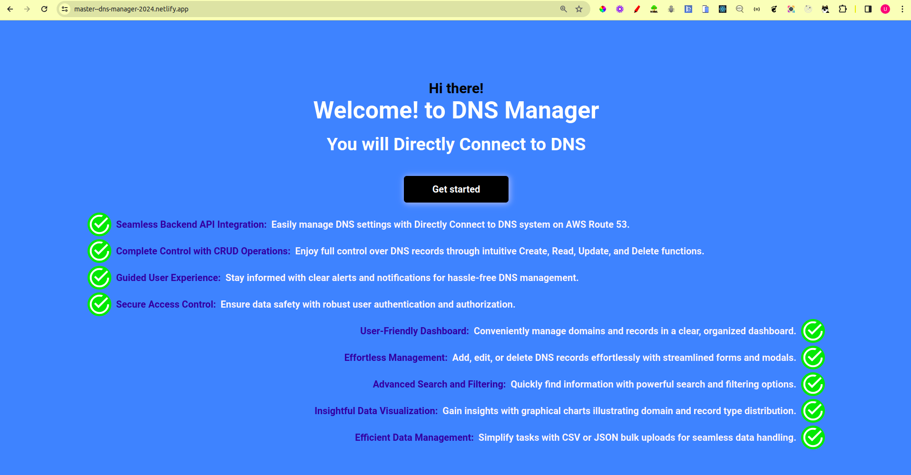
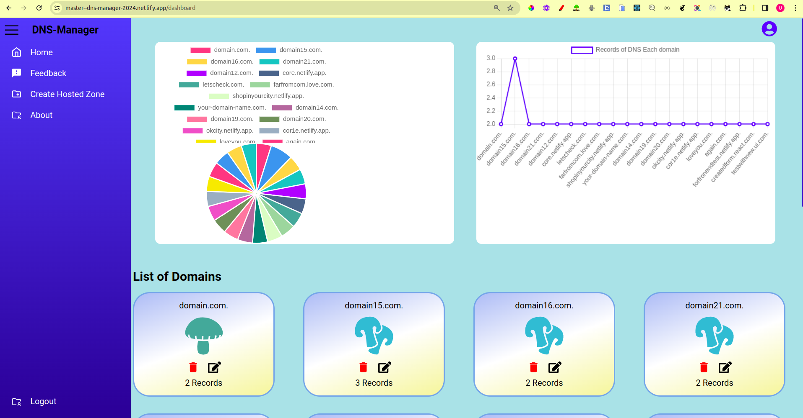

# Frontend



### React 


# Backend API


## Domain


GET
Hello world

```
https://dns-manager-1-b1ij.onrender.com/

```
---
GET
all
```
https://dns-manager-1-b1ij.onrender.com/api/v1/dns-records/all?HostedZoneId=Z08675451R065VIY3K2XK
```
Query Params
```
HostedZoneId = Z08675451R065VIY3K2XK
```
---

POST
create
```https://dns-manager-1-b1ij.onrender.com/api/v1/domain/create```

Body
```
 [  
      {
        
        "Name": "forfronendtest.netlify.app"
      
    }
 ]
 ```
 
 
 
 POST
Delete

```https://dns-manager-1-b1ij.onrender.com/api/v1/domain/delete```

Body

```
  [ 
    {
        "Name":"loveyou.com"
    },
    {
        "Name": "domain30.com"
    },
    {
        "Name": "domain31.com"
    }
  ]
```

## DNS records
GET all

```
https://dns-manager-1-b1ij.onrender.com/api/v1/dns-records/all?HostedZoneId=Z08675451R065VIY3K2XK
```

Query Params
```
HostedZoneId = Z08675451R065VIY3K2XK
```


POST
create
```
https://dns-manager-1-b1ij.onrender.com/api/v1/dns-records/create-multi

 {
    "Name": "ipv7.loveyou.com.",
    "Type": "AAAA",
    "TTL": 3600,
    "ResourceRecords": [
        {
            "Value": "2001:0db8:85a3:0000:0000:8a2e:0370:7334"
        }
    ]
 }

```

POST
Delete Record
```
https://dns-manager-1-b1ij.onrender.com/api/v1/dns-records/update
```

```

[  
    {
            "Name": "loveyou.com.",
            "Type": "A",
            "TTL": 800,
            "ResourceRecords": [
                {
                    "Value": "192.0.2.1"
                },
                {
                    "Value": "192.0.2.3"
                },
                {
                    "Value": "192.0.2.4"
                }
            ]
    }

]
  
```

